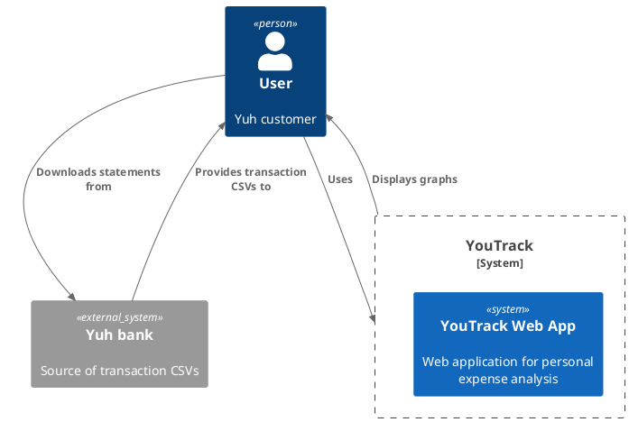
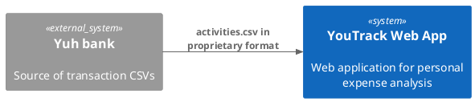
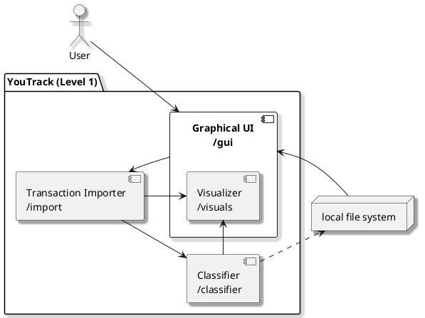
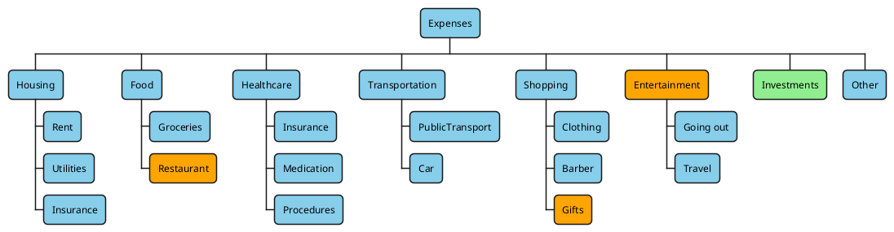
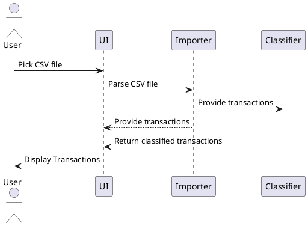

# Introduction and Goals
This document describes YouTrack, a webapp that ingests ativity reports from YUH and aggregates the data meaningfully for the user to track their expenses. It displays interactive graphs to suit the needs of the user.
YouTrack is a new project, not based on existing products.

The following goals have been identified:
<table>
<colgroup>
<col style="width: 10%" />
<col style="width: 90%" />
</colgroup>
<thead>
<tr class="header">
<th style="text-align: left;">Priority</th>
<th style="text-align: left;">Goal</th>
</tr>
</thead>
<tbody>
<tr>
<td style="text-align: left;">1</td>
<td style="text-align: left;">For me to learn how to use SW Architect tools and practice them</td>
</tr>
<tr>
<td style="text-align: left;">2</td>
<td style="text-align: left;">YouTrack must be usable without authentication, and keep all private data locally on the machine of the user</td>
</tr>
</tr>
<tr>
<td style="text-align: left;">3</td>
<td style="text-align: left;">YouTrack shall employ a captivating and modern UI</td>
</tr>
</tr>
<tr>
<td style="text-align: left;">4</td>
<td style="text-align: left;">YouTrack shall be available as a regular website, reachable from any device</td>
</tr>
</tbody>
</table>

## Requirements Overview
YouTrack must be capable of the following

<table>
<colgroup>
<col style="width: 10%" />
<col style="width: 30%" />
<col style="width: 60%" />
</colgroup>
<thead>
<tr class="header">
<th style="text-align: left;">ID</th>
<th style="text-align: left;">Requirement</th>
<th style="text-align: left;">Explanation</th>
</tr>
</thead>
<tbody>
<tr>
<td style="text-align: left;">R1</td>
<td style="text-align: left;">Displaying graphs</td>
<td style="text-align: left;">Display interactive graphs to offer insight into spending and saving habits</td>
</tr>
<tr>
<td style="text-align: left;">R2</td>
<td style="text-align: left;">Classifying expenses</td>
<td style="text-align: left;">Offer an automatic classification of expenses and possibility to customize it</td>
</tr>
<tr>
<td style="text-align: left;">R2.1</td>
<td style="text-align: left;">Storing classification rules</td>
<td style="text-align: left;">Offer a way to export classification rules locally so they persist across sessions</td>
</tr>
<tr>
<td style="text-align: left;">R3</td>
<td style="text-align: left;">Modern, polished and consistent UI</td>
<td style="text-align: left;"></td>
</tr>
<tr>
<td style="text-align: left;">R3.1</td>
<td style="text-align: left;">Light vs Dark mode</td>
<td style="text-align: left;"></td>
</tr>
<tr>
<td style="text-align: left;">R3.2</td>
<td style="text-align: left;">Colorblind accessible</td>
<td style="text-align: left;"></td>
</tr>
</tbody>
</table>


## Quality Goals

<table>
<colgroup>
<col style="width: 10%" />
<col style="width: 20%" />
<col style="width: 70%" />
</colgroup>
<thead>
<tr class="header">
<th style="text-align: left;">Priority</th>
<th style="text-align: left;">Goal</th>
<th style="text-align: left;">Description</th>
</tr>
</thead>
<tbody>
<tr>
<td style="text-align: left;">1</td>
<td style="text-align: left;">Security</td>
<td style="text-align: left;">When user uploads their data, it must never leave their computer</td>
</tr>
<tr>
<td style="text-align: left;">2</td>
<td style="text-align: left;">Functional suitability</td>
<td style="text-align: left;">Visualization of data must always be mathematically correct</td>
</tr>
<tr>
<td style="text-align: left;">3</td>
<td style="text-align: left;">Performance efficiency</td>
<td style="text-align: left;">The platform must handle up to tens of thousands of transactions and display every graph in less than 0.5s</td>
</tr>
</tbody>
</table>

## Stakeholders

<table>
<colgroup>
<col style="width: 20%" />
<col style="width: 10%" />
<col style="width: 70%" />
</colgroup>
<thead>
<tr class="header">
<th style="text-align: left;">Role/Name</th>
<th style="text-align: left;">Contact</th>
<th style="text-align: left;">Expectations</th>
</tr>
</thead>
<tbody>
<tr>
<td style="text-align: left;">Project owner</td>
<td style="text-align: left;">Michele</td>
<td style="text-align: left;"></td>
</tr>
<tr>
<td style="text-align: left;">Developer(s)</td>
<td style="text-align: left;">Michele (et el.?)</td>
<td style="text-align: left;">Clear diagrams, goals, goals hierarchy, quality expectations to implement</td>
</tr>
<tr>
<td style="text-align: left;">QA</td>
<td style="text-align: left;">Michele (et el.?)</td>
<td style="text-align: left;">Description of test cases and conditions, performance expectations and measuring points</td>
</tr>
</tbody>
</table>

# Architecture Constraints

YouTrack must:
- Be available on all devices capable of browsing a website and provide the transactions csv file;
- Function with data always being local
- Be legally available free of charge. No ads, no tracking, no data collection.
- Be based on free technologies and frameworks.
- Be developed, deployed and maintained with sporadic effort by a single developer (< 10 hrs/week)

# Context and Scope

## Business Context


Because Yuh does not offer an API, the user must manually request the csv from the bank and upload it to YouTrack

## Technical Context


The format is
```DATE;ACTIVITY TYPE;ACTIVITY NAME;DEBIT;DEBIT CURRENCY;CREDIT;CREDIT CURRENCY;CARD NUMBER;LOCALITY;RECIPIENT;SENDER;FEES/COMMISSION;BUY/SELL;QUANTITY;ASSET;PRICE PER UNIT```, with `;` as separator

# Solution Strategy

### Technological decisions
- Due to the availability of technical experience (i.e. I am the sole developer and these are the tools I know), the webapp is going to be built in TS (for the nice typing) with React, which can take care of stateful values and minimize re-renderings.
- Due to the availability of technical experience, UI is built with tailwind
- 100'000 transactions hypotetically loaded in memory are expected to take up a few MB, so there shall be no local db or special file handling.
- In order to minimize cost and deployment overhead, the webapp will be deployed using AWS Amplify's free tier as long as possible

### Top level architecture
- Importer (csv -> internal format)
- Graph(s) (filtered/aggregated transactions -> visual representation), across different sections or pages
- Classifier (Transaction data -> category)

### Quality-related decisions
- Transactions are kept loaded in memory for quick manipulation and filtering
- R2 (Functional suitability) and R3 (Performance efficiency) are going to be ensured with unit, integration and end-to-end tests.

### Organizational decisions
- To minimize deployment overhead, AWS amplify will pick this app up from a github repo.
- The repo will need a stable main branch, to which new features will be added by PRs that have to pass automated tests.

# Building Block View

## Whitebox Overall System



Motivation  
The top level decomposition of the system is based on the separation of component responsibilities.

Contained Building Blocks  
- Graphical UI: the only component the User can directly interact with
    - Visualizer: visualizes the data in multiple graphs
- Transaction Importer: converts the CSV file into an internal format
- Classifier: classifies the transactions into categories

Important Interfaces
- The classifier interfaces to the local file system to store and load classification rules
- The visualizer interfaces to the classifier when it needs to get the classified transactions, but sometimes also to the importer when raw transactions are enough


### Transaction interface
```plantuml
interface Transaction {
  + date : Date
  + activityType : Income | Expense
  + activityName : String
  + amount : Float
  + currency : String
  + locality : String
  + recipient/sender : String
  + category : Category
}
```
At its core, YouTrack is an expense tracker, so investments are considered expenses.
Activity date, type, amount, locality, recipient/sender are used directly in the visualizer.
The name is necessary for the classifier

### Classified transaction interface

## Level 2

### White Box Visualizer
A list of different graphs that can be displayed to the user, including:
- Overview panel (Total transactions, total income, total expenses, categorized%)
- Spending insights (Average daily spending, savings rate, most frequent merchant, biggest category, largest single expense)
- Category breakdown (Pie chart)
- Time series (Line chart)
- Geographic breakdown (Map)
- Category vs Time (Line chart)
The same global lists of transactions are available to every chart component from the global context


### Classifier
The classifier assigns every expense transaction to a category, based on a set of rules.
Categories exist in a tree structure, from broad (e.g. Food, Transportation) to specific (e.g. Restaurant, Groceries).
The full tree of categories looks like this:


The "Other" category captures whatever is not in specified categories.


# Runtime View

## Import and display



-   *&lt;insert runtime diagram or textual description of the
    scenario&gt;*

-   *&lt;insert description of the notable aspects of the interactions
    between the building block instances depicted in this diagram.&gt;*


# Deployment View

## Infrastructure Level 1

Motivation  
YouTrack, as a Web App, is supposed to be executed on the user's machine.
It is serverd via the AWS Amplify service, which deals with the complexity of worldwide deployment.
This should grant high availability and scalability, initially at no cost.

Performance will be limited by the user's machine, but the app is supposed to be lightweight and fast on reasonably aged machines.

# Cross-cutting Concepts
Due to the simple nature of the app's architecture, the only cross-cutting concepts worth mentioning are:
- Logging, to be managed with a single logger component
- UI, for which components are built with tailwind and react

# Architecture Decisions
[ADR](ADR.md)


# Quality Requirements

## Quality Requirements Overview

<table>
<colgroup>
<col style="width: 10%" />
<col style="width: 20%" />
<col style="width: 60%" />
<col style="width: 10%" />
</colgroup>
<thead>
<tr class="header">
<th style="text-align: left;">Category</th>
<th style="text-align: left;">Quality</th>
<th style="text-align: left;">Description</th>
<th style="text-align: left;">Scenario</th>
</tr>
</thead>
<tbody>
<tr>
<td style="text-align: left;">Security</td>
<td style="text-align: left;">Privacy</td>
<td style="text-align: left;">User data must never leave their computer, so it's harder to attack</td>
<td style="text-align: left;">SC1</td>
</tr>
<tr>
<td style="text-align: left;">Functional suitability</td>
<td style="text-align: left;">Correctness</td>
<td style="text-align: left;">Represented data must be correct</td>
<td style="text-align: left;"></td>
</tr>
<tr>
<td style="text-align: left;"></td>
<td style="text-align: left;">Functional appropriateness</td>
<td style="text-align: left;">The available graphs shall offer a comprehensive view of expenses</td>
<td style="text-align: left;">SC2</td>
</tr>
<tr>
<td style="text-align: left;">Performance efficiency</td>
<td style="text-align: left;">Response time</td>
<td style="text-align: left;">The time it takes the app to load, classify and display transactions</td>
<td style="text-align: left;">SC4</td>
</tr>
<tr>
<td style="text-align: left;"></td>
<td style="text-align: left;">Startup time</td>
<td style="text-align: left;">The time it takes the app to load in the browser</td>
<td style="text-align: left;">SC3</td>
</tr>
</tbody>
</table>

## Quality Scenarios

<table>
<colgroup>
<col style="width: 10%" />
<col style="width: 90%" />
</colgroup>
<thead>
<tr class="header">
<th style="text-align: left;">Id</th>
<th style="text-align: left;">Scenario</th>
</tr>
</thead>
<tbody>
<tr>
<td style="text-align: left;">SC1</td>
<td style="text-align: left;">A user shall be able to operate the app in its entirety, without authentication and even offline, once it's loaded in the browser</td>
</tr>
<tr>
<td style="text-align: left;">SC2</td>
<td style="text-align: left;">A user shall be able to find an answer to general questions about spending habits, modify the classification rules as they see fit and have such changes persist across sessions</td>
</tr>
<tr>
<td style="text-align: left;">SC3</td>
<td style="text-align: left;">A user shall be able to load the webapp in under 0.5s with regular internet connection</td>
</tr>
<tr>
<td style="text-align: left;">SC4</td>
<td style="text-align: left;">A user shall be able to have 10'000 transactions loaded in memory and display every graph in less than 1s</td>
</tr>
</tbody>
</table>

# Risks and Technical Debts
- There is a risk that errors in the development will lead to incorrect data representation. This is mitigated by the use of tests on known datasets.
- No technical debt is expected, as the app is supposed to be small and simple, and is built from scratch.

# Glossary

<table>
<colgroup>
<col style="width: 33%" />
<col style="width: 66%" />
</colgroup>
<thead>
<tr class="header">
<th style="text-align: left;">Term</th>
<th style="text-align: left;">Definition</th>
</tr>
</thead>
<tbody>
<tr class="odd">
<td style="text-align: left;"><p><em>&lt;Term-1&gt;</em></p></td>
<td style="text-align: left;"><p><em>&lt;definition-1&gt;</em></p></td>
</tr>
<tr class="even">
<td style="text-align: left;"><p><em>&lt;Term-2&gt;</em></p></td>
<td style="text-align: left;"><p><em>&lt;definition-2&gt;</em></p></td>
</tr>
</tbody>
</table>
